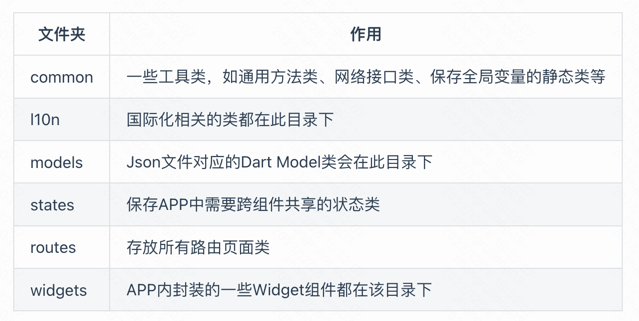

# Flutter APP代码结构

我们先来创建一个全新的Flutter工程，命名为"github_client_app"；创建新工程的步骤视读者使用的编辑器而定，都比较简单，在此不再赘述。创建完成后，工程结构如下：
```markdown
github_client_app
├── android
├── ios
├── lib
└── test
```

由于我们需要使用外部图片和Icon资源，所以我们在项目根目录下分别创建“imgs”和“fonts”文件夹，前者用于保存图片，后者用于保存Icon文件。关于图片和Icon，读者可以参考第三章中相应的内容。

由于在网络数据传输和持久化时，我们需要通过Json来传输、保存数据；但是在应用开发时我们又需要将Json转成Dart Model类，现在我们使用在第十一章中“Json转Model”小节中介绍的方案，所以，我们需要在根目录下再创建一个用于保存Json文件的“jsons”文件夹。

多语言支持我们使用第十三章“国际化”中介绍的方案，所以还需要在根目录下创建一个“l10n”文件夹，用于保存各国语言对应的arb文件。

现在工程目录变为：

```markdown
github_client_app
├── android
├── fonts
├── l10n-arb
├── imgs
├── ios
├── jsons
├── lib
└── test
```

由于我们的Dart代码都在“lib”文件夹下，笔者根据技术选型和经验在lib文件下创建了如下目录：

```markdown
lib
├── common
├── l10n
├── models
├── states
├── routes
└── widgets
```

